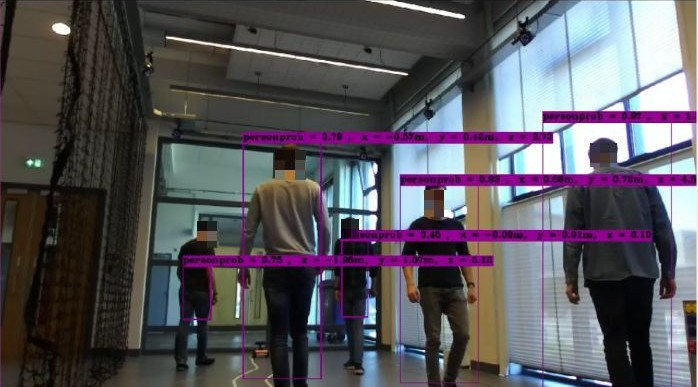
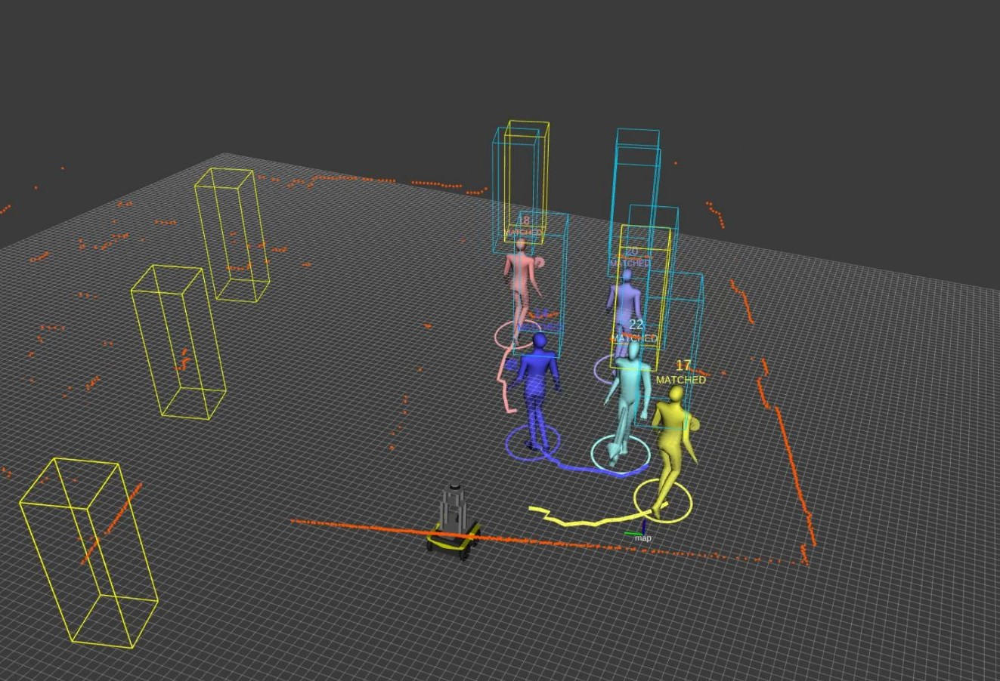

# Spencer People Tracker with YOLO
This package integrates the data-driven [YOLO object detector](https://pjreddie.com/darknet/yolo/) as a pedestrian detector into the Spencer People Tracking pipeline. The [ZED-YOLO wrapper](https://github.com/stereolabs/zed-yolo) from Stereolabs was integrated into ROS and then added to the Spencer tracking pipeline. Thus, the YOLO  object detector is specifically designed to work with the ZED camera. The rest of the package can also be used with other devices, e.g. a RealSense camera. 

More information about the functionalities of the Spencer People Tracking package can be found [here](spencer_people_tracking/README.md). 

With YOLO, pedestrians can be detected at close range (min. distance is approx. 0.9m) and up to a distance of several meters. Their position is computed using the depth measurements from the ZED camera. Since YOLO has a low false positive rate (depending on the chosen parameters and the weight file), it is possible to filter out false positives from the LIDAR based detector. 

The most important features of this package are listed here:
- Detect pedestrians using the ZED camera from Stereolabs and the YOLO object detector
- Use a YOLO model that was trained on the COCO dataset, which contains Pedestrians as a class. Thus, no additional training is neccessary
- Filter multiple detections of the same pedestrian using nonmax suppression
- Compute the pedestrian's Position using the pointcloud from the ZED stereo camera
- The ZED-YOLO wrapper is integrated into ROS 
- A LIDAR measures the distance to the surface of a solid body, but one is usually interested in the distance to the center of a body. The package **static calibration** corrects for that offset
- Other detectors which were already implemented in the Spencer package can still be used, also with other cameras than the ZED camera
- The YOLOv3 model is able to run at around 18 FPS on an nvidia jetson agx xavier board

Below one can see YOLO detections in an RGB image and the visualizations in rviz. Yellow boxes: LIDAR based detections. Blue boxes: YOLO detections

<a href="https://youtu.be/Abm3NSPFdbk" target="_blank">
</img>
</a>

</img>

## Hardware Requirements
This package has been tested with the following Sensors:
- [Velodyne VLP16 LIDAR](https://velodynelidar.com/vlp-16.html)
- [Stereolabs ZED Stereo camera](https://www.stereolabs.com/zed/)

## Software Requirements
- Ubuntu 16.04
- Cuda 9.0
- cuDNN 7.6
- [ZED SDK for Ubuntu 16.04 and CUDA 9.0](https://www.stereolabs.com/developers/release/#sdkdownloads_anchor)
- ROS Kinetic
- OpenCV 2.4 (follow [this](https://gist.github.com/sedovolosiy/6711123a9e5a73a6ce519e80338d0067) guide. Careful: it might be that for the cmake command, you have to add -D WITH_CUDA=OFF)

## Installation
Create Catkin workspace, clone the repo and install dependencies:

    sudo apt-get install python-catkin-tools
    mkdir -p catkin-ws/src
    cd catkin-ws
    catkin config --init --cmake-args -DCMAKE_BUILD_TYPE=RelWithDebInfo
    cd src
    git clone https://github.com/PhiAbs/spencer_people_tracking_yolo.git
    rosdep update
    rosdep install -r --from-paths . --ignore-src
    sudo apt-get install libsvm-dev

Compile Darknet: A fork from @AlexeyAB is [used](https://github.com/AlexeyAB/darknet)

    cd spencer_people_tracking_yolo/zed-yolo/libdarknet
    make -j4

Build the ROS packages

    cd catkin_ws
    catkin build -c -s
    source devel/setup.bash

## Weight files
There are two different weight files one can use. The lightweight YOLOv3 model is able to run at around 18 FPS on an nvidia jetson agx xavier board. The heavier YOLOv3 model is slower but has a slightly better detection accuracy. It is recommended to use the lightweight model. 

Download them from [here](https://pjreddie.com/darknet/yolo/)
and place them in here:

    spencer_people_tracking_yolo/zed-yolo/libdarknet/weights

## Running the Detection-Tracking-Pipeline 

### Launch the YOLO Pedestrian detection module
There are two different launch files available, one for either of the two weight files:

lighweight model:
    
    roslaunch yolo_pedestrian_detector pedestrian_detector_tiny.launch

normal model:

    roslaunch yolo_pedestrian_detector pedestrian_detector.launch

### Launch the Spencer people tracking pipeline
In the launch file below, one can choose the pedestrian detector one wants to use. YOLO is the default detector.
One must publish the camera's and LIDAR's tf. This can be done in the launch file if it is not done anywhere else already (set to False by default). 

    roslaunch spencer_people_tracking_launch tracking_with_yolo.launch

## References
[Link](https://drive.google.com/file/d/17gYQlm1KNR1uVZGOEhCawVPUrMDU37_R/view?usp=sharing) to Semester Thesis.
